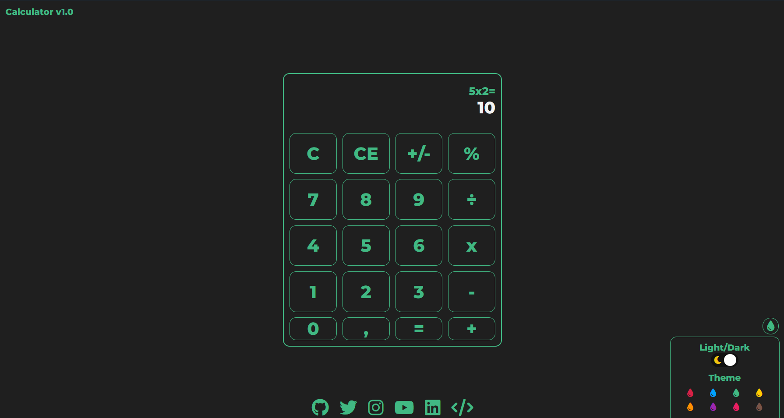
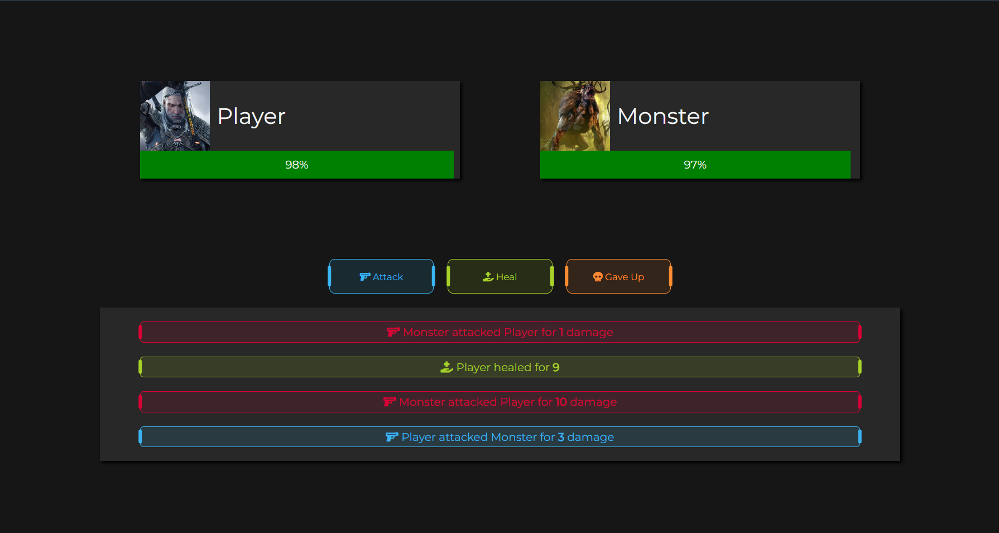

# myygunduz.com
     


## Project setup
```
npm install
```

### Compiles and hot-reloads for development
```
npm run serve
```

### Compiles and minifies for production
```
npm run build
```

### Lints and fixes files
```
npm run lint
```

### Customize configuration
See [Configuration Reference](https://cli.vuejs.org/config/).

<a href="https://cli.vuejs.org/">Click for more information</a>


### My One Page Projects On the Web


<h3 style="text-align:center;">Yedi Meşaleciler</h3>
(school project)

<a href="https://projects.myygunduz.com/yedimesaleciler/">Go To Page</a>
<hr/>



<h3 style="text-align:center;">Calculator</h3>
<a href="https://projects.myygunduz.com/Calculator/">Go To Page</a>
<hr/>



<h3 style="text-align:center;">Attack On Monster</h3>
<a href="https://projects.myygunduz.com/AttackOnMonster/">Go To Page</a>
<hr/>


<table align='center'>
    <tr>
        <td>
            <a href="https://web.facebook.com/sharer.php?t=Look%20what%20I%20found&u=https://github.com/myygunduz/myygunduz.github.io&_rdc=1&_rdr" >
                
            </a>
        </td>
        <td>
            <a href="https://www.facebook.com/dialog/send?link=https://github.com/myygunduz/myygunduz.github.io&app_id=291494419107518&redirect_uri=https://github.com/myygunduz/myygunduz.github.io" >
                
            </a>
        </td>
        <td>
            <a href="https://twitter.com/intent/tweet?text=Look%20what%20I%20found&url=https://github.com/myygunduz/myygunduz.github.io" >
                
            </a>
        </td>
        <td>
            <a href="https://web.whatsapp.com/send?text=Look%20what%20I%20found https://github.com/myygunduz/myygunduz.github.io" >
                
            </a>
        </td>
        <td>
            <a href="https://t.me/share/url?url=https://github.com/myygunduz/myygunduz.github.io&text=GLook%20what%20I%20found" >
                
            </a>
        </td>
        <td>
            <a href="https://www.linkedin.com/shareArticle?title=Look%20what%20I%20found&url=https://github.com/myygunduz/myygunduz.github.io" >
                
            </a>
        </td>
        <td>
            <a href="https://www.reddit.com/submit?title=Look%20what%20I%20found&url=https://github.com/myygunduz/myygunduz.github.io" >
                
            </a>
        </td>
    </tr>
</table>